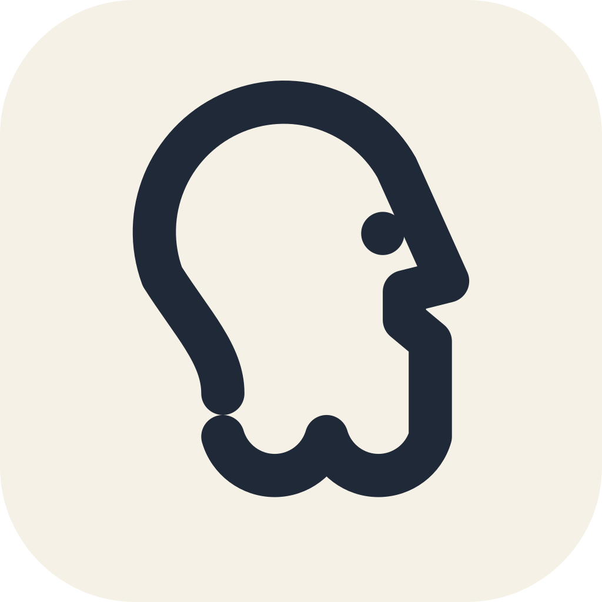

<p align="center">
  
</p>

<h1 align="center">layman</h1>

<p align="center">
  Say <em>I'm lost</em> and Claude explains it again, plainly.
</p>

<p align="center">
  <a href="https://github.com/varunmoka7/layman/releases"></a>
  <a href="LICENSE"></a>
  <a href="https://github.com/varunmoka7/layman/actions/workflows/test.yml"></a>
</p>

---

Claude Code writes its replies for programmers. When you are not one, or it
is late, a reply can be four paragraphs of words you do not know, and the
easiest thing is to nod and move on.

layman is the friend who leans over and says "in other words". Type `layman`,
`I'm lost` or `explain again`, and the next reply comes back in everyday
words: one idea, one example from your own work, one comparison to something
ordinary, and at most one yes-or-no question. Ask twice in a session and
every reply stays plain until you switch it off.

The icon is a philosopher drawn with one line. That is the whole idea.

## Install

```text
/plugin marketplace add varunmoka7/layman
/plugin install layman@layman
```

Needs Claude Code 2.1 or later. Nothing else to set up.

## Use

Type one of these as your prompt. Capital letters do not matter.

| Say | Also works |
|-----|------------|
| `layman` | `lay man` |
| `I'm lost` | `im lost`, `i am lost` |
| `explain again` | `explain it again`, `explain that again` |
| `didn't understand` | `dont understand`, `do not understand`, and the usual typos |

Only prompts of 200 characters or less count. A long bug report that quotes
"I'm lost" is about something else.

| Command | What happens |
|---------|--------------|
| `/layman on` | Every reply stays plain. The status line shows `plain mode`. |
| `/layman off` | Back to normal. |
| `/layman` | Flips it. |

Plain mode also switches itself on at your second ask in a session.

## Before and after

You asked why your build fails and got a paragraph about peer dependency
resolution. You type `layman`. The reply now reads:

> Your project asked for two different versions of the same library and npm
> refused to pick one. It is like two people booking the same seat. Run
> `npm install react@18` so both sides agree on one version. Want me to run
> it? I would.

## How it works

One hook runs on every prompt you submit. It does three things:

1. **Count.** If the prompt matches a phrase above, the ask count goes up by one.
2. **Decide.** Two or more asks, and plain mode is on.
3. **Attach a note.** For a matching ask, or any prompt while plain mode is
   on, it adds a short note to the context the model reads: everyday words
   from the first line, one idea, one real example, one everyday comparison,
   define any term in the same sentence or leave it out, no new topics.

Otherwise it adds nothing and your prompt goes through untouched. The note
itself is six sentences in
[`skills/layman/SKILL.md`](skills/layman/SKILL.md). Paste them into any
Claude chat and you have layman without installing anything.

**In the Claude apps and Cowork** there are no hooks, so the same six
sentences ship as a skill. The model applies them when you ask for a plain
explanation. There is no counter there.

## Privacy

Everything runs on your computer. The plugin reads your prompt to check for
a phrase and keeps one number, the ask count, for the session. No network
calls, nothing stored, nothing sent.

## Development

```sh
claude plugin test .       # phrases match, near misses do not, plain mode switches
claude plugin validate .   # plugin files are well formed
```

```text
.claude-plugin/   plugin.json, marketplace.json, icon
hooks/            the hook and the /layman command
skills/layman/    SKILL.md, the rules as a skill
assets/logo/      the logo as SVG
tests/            the test suite
```

Both commands run on GitHub for every change. Tested on macOS with Claude
Code 2.1.288.

Issues and pull requests are welcome. If you add a phrase, add it to the
hits list in `tests/layman.test.ts` and to the table above. Keep the plugin
small: one hook, one command, no network. Security issues go through
[private vulnerability reporting](https://github.com/varunmoka7/layman/security/advisories/new).

## License

[MIT](LICENSE)
